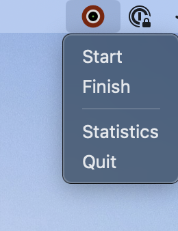
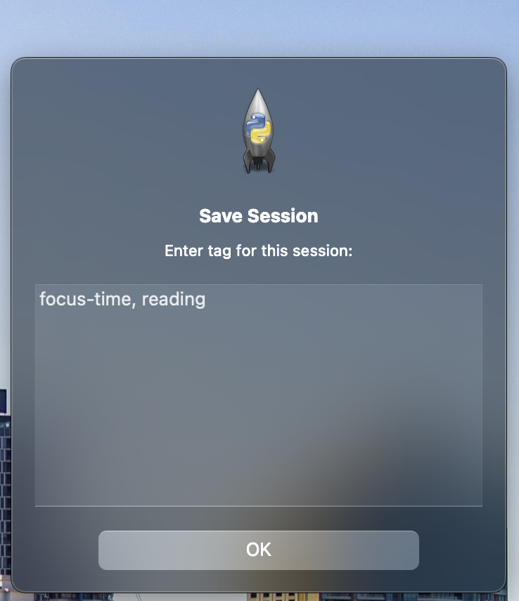
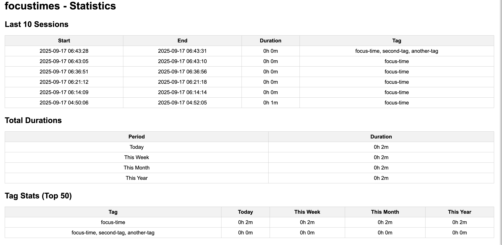

### What is Focustimes?
Simple Macos Menu Bar app.
You can record focus session with appropriate tagging and see the statistics. That's it.


### How to use focustimes?

Launch the app, it will appear in the Menu Bar.



Click **Start** to begin focus session. When you're done finish session with tagging.



Click **Statistics** to see session history and your focus time summary



## For Developers
### Permissions
```
$ chmod +x build.sh
```

### Create dmg file
```
$ ./build.sh
```

## Installation

1. Drag `focustimes.app` into your `/Applications` folder.
2. Because the app is not signed, macOS may block it.  
   To fix this, open Terminal and run:

```bash
xattr -d com.apple.quarantine /Applications/focustimes.app
```